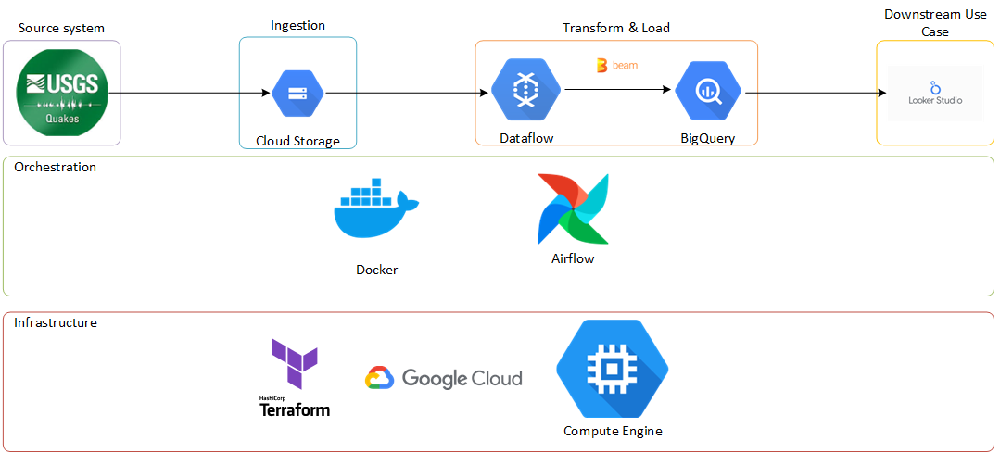
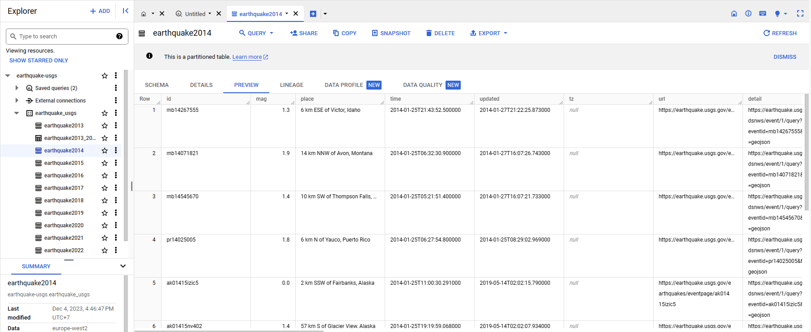
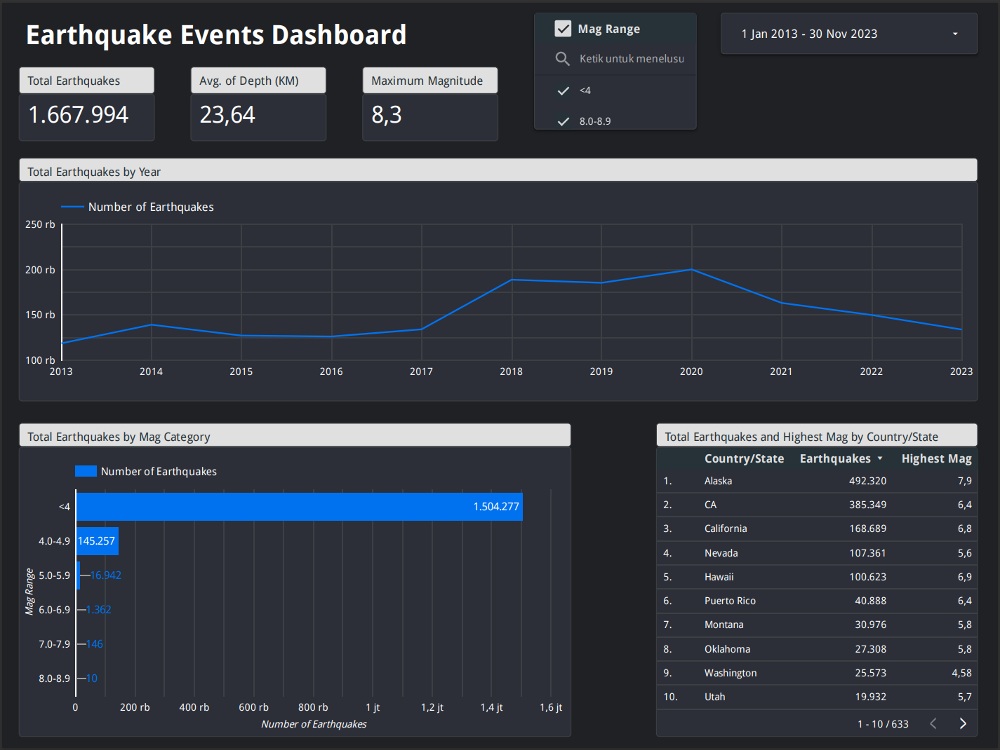

# USGS Earthquake Automated Data Pipeline

- [USGS Earthquake Automated Data Pipeline](#usgs-earthquake-automated-data-pipeline)
  - [Problem Statement](#problem-statement)
  - [Main Objective](#main-objective)
  - [Dataset Description](#dataset-description)
  - [Automated Data Pipeline Solution](#automated-data-pipeline-solution)
    - [IaC](#iac)
    - [Orchestration](#orchestration)
    - [Ingestion Process](#ingestion-process)
    - [Transformation Process](#transformation-process)
    - [Data Warehouse](#data-warehouse)
    - [Dashboard](#dashboard)

## Problem Statement
Earthquakes are natural phenomena that require thorough analysis for better understanding. To conduct comprehensive analysis related to earthquake activities, access to massive and continuous data is necessary.

However, challenges arise when managing large volumes of data efficiently. Manual processes for collecting, processing, and loading large amounts of data not only consume significant time but also increase the risk of errors due to repetitive tasks.

Therefore, a solution is needed to optimize data management by creating the "Automated Data Pipeline." This automated data pipeline is designed to address challenges in earthquake analysis by automating the entire process, from data retrieval to loading data into the data warehouse.

## Main Objective
Build data infrastucture including computation and storage resources, develop data pipeline, and create dashboard as example of the use case for data produced by the data pipeline.
The steps include:
- Select dataset.
- Create pipeline for collect the data from the source and putting it to a data lake.
- Transform the data in the data lake and load into data warehouse.
- Create a dashboard.

  

## Dataset Description
Data for this project is sourced via API requests from the [U.S. Geological Survey](https://earthquake.usgs.gov/earthquakes/search/), providing comprehensive details about earthquake events worldwide. Updated daily, the data can be retrieved in various formats, and this project specifically collects data in GeoJSON format. Each dataset comprises earthquake events, metadata, and a geolocation summary.

To initiate an API request, a link such as https://earthquake.usgs.gov/fdsnws/event/1/query?format=geojson&starttime=2023-01-01&endtime=2023-01-02 is used, featuring three key parameters:
- **format** = Options include geojson, csv, etc.
- **starttime** = Denotes the starting date in YYYY-MM-DD format (e.g., 2023-01-01).
- **endtime** = Denotes the ending date in YYYY-MM-DD format (e.g., 2023-01-01).

For a more detailed understanding of the data, you can refer to the original [documentation](https://earthquake.usgs.gov/data/comcat/).

To view an example of data response, please refer to the image below:

  

The image below shows an example of earthquake event from data that has been pulled:

  

## Technology
- **Cloud platform**: Google Cloud
- **Infrastructure as code (IaC)**: Terraform
- **Containerization**: Docker
- **Workflow orchestration**: Airflow
- **Batch transformations**: Dataflow
- **Data lake**: Google Cloud Storage (GCS)
- **Data warehouse**: BigQuery
- **Dashboard**: Looker Studio

## Automated Data Pipeline Solution
### IaC
Use Terraform to create Cloud Storage bucket and BigQuery dataset.

### Orchestration
Utilize Apache Airflow for orchestrating the end-to-end data engineering pipeline, covering data ingestion, data transformation, and data loading into the data warehouse. The pipeline is scheduled to run on the first day of every month at 00:00 from January 2013 to November 2023.

  

The dag has mean run duration of 5:25 minutes with max duration of 7:24 minutes and min duration of 4:59 minutes.

  

### Ingestion Process
Make API requests to source systems, capturing data in both GeoJSON and Parquet formats, and store it in Cloud Storage.

  

  

### Transformation Process
Implement a data transformation using Dataflow utilizing Apache Beam to transform data from the data lake and write the processed data into BigQuery tables.

  

### Data Warehouse
Store the transformed data in BigQuery table using One Big Table (OBT) method. The data is organized into separate tables based on the year of the event, the table is partitioned by day and clustered by the region of the event.

  

### Dashboard
Establish a connection between Looker Studio and the BigQuery dataset to design dashboard for comprehensive data visualization. The dashboard can be accessed through this [link](https://lookerstudio.google.com/u/0/reporting/bf365be7-376a-40b4-9cad-1e1ce35cbf3c/page/QiZkD).

  

